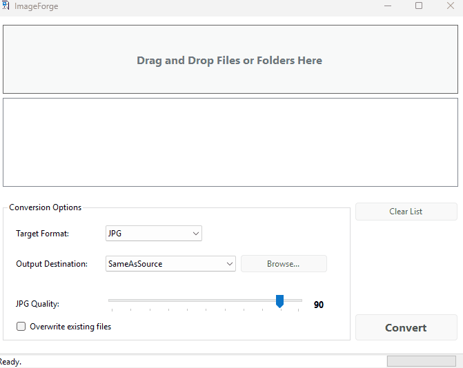

# ImageForge
A powerful, clean, and private desktop image converter. Convert, resize, and manage your images securely on your own machine, offline.
# ImageForge 🖼️✨

A powerful, clean, and private desktop image converter. Convert, resize, and manage your images securely on your own machine, offline.

---

## Why Choose ImageForge?

In a world of sketchy online tools and bloated software, ImageForge provides a simple, fast, and secure solution for your daily image conversion needs.

*   🔐 **Private & Secure:** Your files **never** leave your computer. No uploads, no third-party servers, no privacy concerns. Your data stays yours.
*   🚀 **Blazing Fast & Lightweight:** Built with clean C# code and the .NET Framework, it launches instantly and processes images without hogging your system's resources.
*   🗂️ **Powerful Batch Processing:** Simply drag and drop an entire folder. ImageForge will automatically find and convert all supported images inside, recursively.
*   ✨ **Simple, Not Simplistic:** A minimalist UI hides powerful features like quality control for JPGs, `.ico` file generation for your icons, and flexible output options.

---

## Key Features

- **Multiple Format Support:** Convert between **JPG, PNG, ICO, BMP, GIF, and TIFF**.
- **Intuitive Drag & Drop:** Supports both individual files and entire folders.
- **Adjustable JPG Quality:** Fine-tune the trade-off between file size and image quality with a simple slider (1-100).
- **Overwrite Protection:** A safety checkbox to prevent accidentally overwriting your existing files.
- **Flexible Output Options:**
    - Save to the same folder as the source file.
    - Save directly to your Desktop.
    - Save to any custom folder you choose.
- **Clean & Organized:** The app intelligently separates its logic from the UI, following modern coding practices.

---

## 🚀 Get Started in Seconds

No installation required!

1.  Go to the [**Latest Release Page**](https://github.com/AniLLL3734/ImageForge/releases).
2.  Download the `ImageForge_vX.X.X.zip` file.
3.  Unzip the file anywhere on your computer.
4.  Run `UzantiCeviriciAdvanced.exe`. That's it!

---

## Built With

*   **Language:** C#
*   **Framework:** .NET Framework
*   **UI:** Windows Forms

## License

This project is licensed under the MIT License - see the [LICENSE](LICENSE) file for details.

---

*This project was created with a focus on simplicity, security, and robust performance for everyday tasks. Feel free to open an issue for any bugs or feature requests!*
